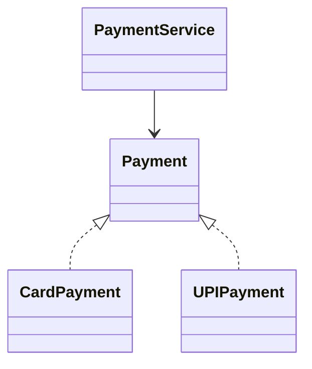

Great idea. A **dedicated repo for design principles in TypeScript** is one of the best ways to actually *internalize* LLD concepts instead of just reading them. We'll structure it like a **mini learning lab**.

Below is a **practical plan, setup, and repo structure**.

---

# 1. Goal of the Repository

Your repo should help you:

1. Learn **design principles**
2. Implement **design patterns**
3. Compare **bad vs good design**
4. Practice **LLD thinking**
5. Build a **reference library for interviews**

Think of it as:

> A playground to practice **SOLID, patterns, and clean architecture in TypeScript**.

---

# 2. Tech Stack (Keep It Simple)

Use minimal tooling so focus stays on **design**.

Recommended stack:

* **TypeScript**
* **Node.js**
* **Jest**
* **ESLint**
* **Prettier**

---

# 3. Project Setup

### Step 1 — Create Repo

```bash
mkdir ts-design-principles
cd ts-design-principles
git init
```

---

### Step 2 — Initialize Node

```bash
npm init -y
```

---

### Step 3 — Install Dependencies

```bash
npm install typescript ts-node @types/node -D
npm install jest ts-jest @types/jest -D
npm install eslint prettier -D
```

---

### Step 4 — Initialize TypeScript

```bash
npx tsc --init
```

Modify `tsconfig.json`:

```json
{
  "compilerOptions": {
    "target": "ES2020",
    "module": "CommonJS",
    "rootDir": "src",
    "outDir": "dist",
    "strict": true
  }
}
```

---

### Step 5 — Setup Jest

```bash
npx ts-jest config:init
```

Add script:

```json
"scripts": {
  "test": "jest"
}
```

---

# 4. Recommended Repository Structure

```
ts-design-principles/

src/

  solid/
    srp/
    ocp/
    lsp/
    isp/
    dip/

  patterns/
    creational/
    structural/
    behavioral/

  principles/
    composition-over-inheritance/
    program-to-interface/
    encapsulation/

  systems/
    parking-lot/
    notification-system/
    payment-system/

  utils/

tests/

docs/

README.md
```

---

# 5. Structure of Each Example

Each concept should have:

```
srp/

bad-example.ts
good-example.ts
README.md
test.ts
```

Example:

```
src/solid/srp/
```

```
bad-user-service.ts
good-user-service.ts
README.md
```

---

# 6. What to Implement (Learning Roadmap)

Follow this order.

---

# Phase 1 — Core OOP Concepts

Create examples for:

* Encapsulation
* Abstraction
* Inheritance
* Polymorphism

Folder:

```
src/principles/oop/
```

---

# Phase 2 — SOLID Principles

Implement each principle with:

* bad example
* refactored solution
* explanation

```
src/solid/
```

Structure:

```
srp/
ocp/
lsp/
isp/
dip/
```

Example exercise:

```
UserService → violates SRP
Refactor → UserService + EmailService + UserRepository
```

---

# Phase 3 — Important Design Patterns

Focus on **important patterns only**.

### Creational

```
singleton
factory
builder
```

### Structural

```
adapter
decorator
```

### Behavioral

```
strategy
observer
command
```

Patterns folder:

```
src/patterns/
```

---

# Phase 4 — Small System Designs

Apply everything in **mini systems**.

Examples:

### 1 Payment System

```
PaymentStrategy
CardPayment
UPIPayment
CryptoPayment
```

Uses:

* Strategy pattern
* DIP
* OCP

---

### 2 Notification System

Channels:

```
Email
SMS
Push
Slack
```

Uses:

* Observer pattern

---

### 3 Parking Lot

Entities:

```
ParkingLot
ParkingSpot
Vehicle
Ticket
```

Good LLD practice.

---

### 4 Logging System

Implement:

```
Logger
ConsoleLogger
FileLogger
```

Uses:

* Singleton
* Factory

---

# 7. Add Documentation

Your repo should include a **docs folder**.

```
docs/
```

Example:

```
docs/

solid.md
design-patterns.md
typescript-tips.md
```

---

# 8. Add Diagrams

You can add UML diagrams using:

* **Mermaid**
* **PlantUML**

Example:



---

# 9. Add Tests for Every Pattern

Example:

```ts
describe("Payment Strategy", () => {
  it("should process card payment", () => {
    const payment = new CardPayment();
    expect(payment.pay()).toBe(true);
  });
});
```

Testing helps **validate design**.

---

# 10. Make Your README Powerful

Include:

```
What this repo covers

✔ SOLID principles
✔ Design patterns
✔ LLD examples
✔ TypeScript best practices
```

Also include **pattern list**.

---

# 11. Optional Advanced Additions

Later you can add:

### Dependency Injection

Example:

* container.ts
* injectable services

Similar to **InversifyJS**

---

### Event System

Implement a mini **event bus**.

---

### Plugin Architecture

Example:

```
editor
plugins
extensions
```

---

# 12. Commit Strategy (Very Useful)

Make commits like:

```
feat: implement SRP example
feat: add strategy pattern
refactor: improve DIP example
docs: add observer explanation
```

This makes repo look **professional**.

---

# 13. Suggested Repo Name

Good names:

```
typescript-design-principles
ts-clean-architecture-lab
ts-design-patterns-playground
llld-typescript
```

---

# 14. Weekly Plan

### Week 1

* OOP concepts
* SRP
* OCP

### Week 2

* LSP
* ISP
* DIP

### Week 3

* Strategy
* Observer
* Factory

### Week 4

* Adapter
* Builder
* Decorator

### Week 5

* Parking Lot
* Notification System

---

# 15. What Makes This Repo Truly Valuable

Don't just implement patterns.

Always include:

```
Problem
Bad Design
Why It Fails
Refactored Design
Explanation
```

That is how **real engineers learn design**.

---

✅ If you'd like, I can also give you a **complete repo template structure with starter TypeScript files** so you can **copy-paste and start coding immediately.**
